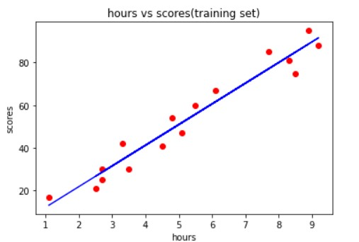
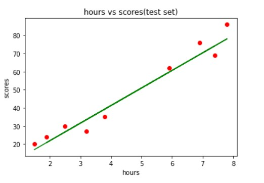

# Implementation-of-Simple-Linear-Regression-Model-for-Predicting-the-Marks-Scored

## AIM:
To write a program to implement the simple linear regression model for predicting the marks scored.

## Equipments Required:
1. Hardware – PCs
2. Anaconda – Python 3.7 Installation / Moodle-Code Runner

## Algorithm
1. Import the standard Libraries.
2. Set variables for assigning dataset values.
3. Import linear regression from sklearn.
4. Assign the points for representing in the graph
5. Predict the regression for marks by using the representation of the graph.
6. Compare the graphs and hence we obtained the linear regression for the given datas.


## Program:
```
Program to implement the simple linear regression model for predicting the marks scored.
Developed by:KRISHNA PRAKAASH D M
RegisterNumber: 212221230052

import pandas as pd
import matplotlib.pyplot as  plt
a=pd.read_csv('/content/student_scores - student_scores.csv')
a.head()
x=a.iloc[:,:-1].values
y=a.iloc[:,-1].values
from sklearn.model_selection import train_test_split
x_train,x_test,y_train,y_test=train_test_split(x,y,test_size=1/3,random_state=0)
from sklearn.linear_model import LinearRegression
regressor=LinearRegression()
regressor.fit(x_train,y_train)
y_pred=regressor.predict(x_test)
plt.scatter(x_train,y_train,color="Red")
plt.plot(x_train,regressor.predict(x_train),color='Red')
plt.title("hours vs scores(training set)")
plt.xlabel("hours")
plt.ylabel("scores")
plt.show()
plt.scatter(x_test,y_test,color="Red")
plt.plot(x_test,regressor.predict(x_test),color='Green')
plt.title("hours vs scores(test set)")
plt.xlabel("hours")
plt.ylabel("scores")
plt.show()

```

## Output:
## Training dataset:



## Test dataset:



## Result:
Thus the program to implement the simple linear regression model for predicting the marks scored is written and verified using python programming.
